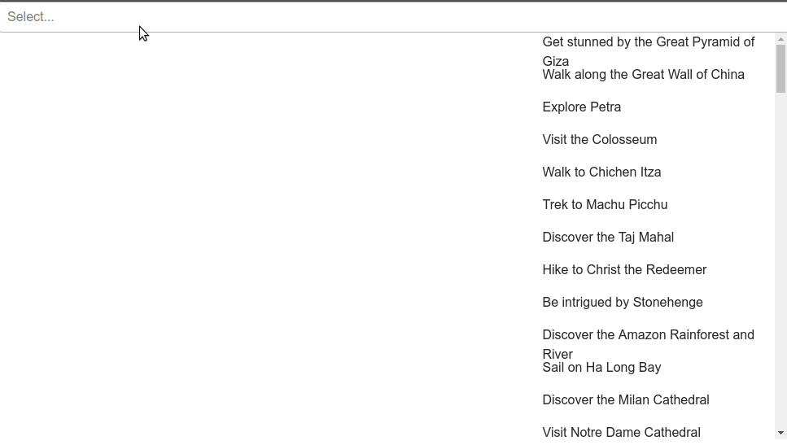

# Rivi Frontend Task By Sanket Kumar Singh

Technologies used:-
- React
- Redux
- Material-ui
- Bootstrap

React-virtualized was used in order to only load the elements of the list when the user scrolls to them.

Here is a gif showing the working.

